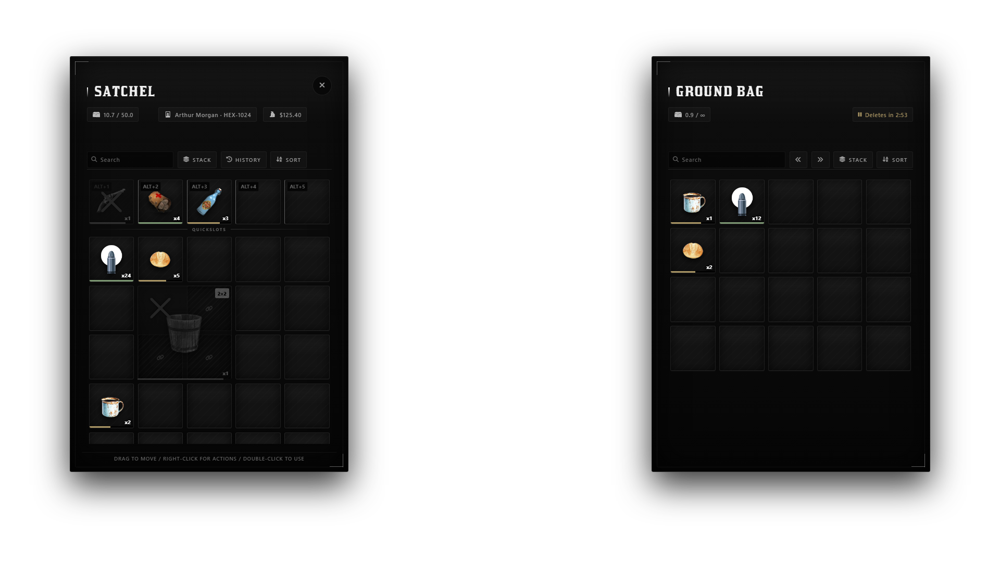

<div align="center">

# HEXA INVENTORY

### Persistent grid inventory for RedM

A server-authoritative inventory system for [`hexa_core`](https://github.com/hexa-development/hexa_core), built around flexible grids, persistent storage, secure transactions, and extensible item behaviour.

<br>

[](https://hexa-development.github.io/hexa-docs/)
[](https://redm.net/)
[](https://www.lua.org/)
[](https://github.com/hexa-development/hexa_core)

<br>

**Grid Inventory · Stashes · Shops · Drops · Trading · Quick Slots · Persistence**

</div>

---

## About

**hexa_inventory** is the primary inventory system for the **Hexa Framework** ecosystem.

It provides persistent player inventories and shared containers through a grid-based interface where items can occupy different amounts of space instead of being limited to traditional one-item-per-slot layouts.

The system is designed around three rules:

- **The server owns inventory state**
- **The client never decides whether a transaction is valid**
- **Inventory behaviour should be configurable without rewriting core logic**

```text
Player
  │
  ▼
┌───────────────────────────┐
│      hexa_inventory       │
├───────────────────────────┤
│ Player Inventory          │
│ Quick Slots               │
│ Stashes                   │
│ Shops                     │
│ Ground Drops              │
│ Trading                   │
│ Item History              │
│ Durability                │
│ Grid Validation           │
└─────────────┬─────────────┘
              │
              ▼
         hexa_core
              │
              ▼
         Persistence
```

---

## Features

### Grid-Based Inventory

Items can occupy one or multiple cells within the inventory.

A normal item may use a single cell:

```text
┌───┐
│ × │
└───┘

1 × 1
```

while larger items can consume more physical inventory space:

```text
┌───┬───┐
│   │   │
├───┼───┤
│   │   │
└───┴───┘

2 × 2
```

Item footprints can be configured individually:

```lua
config.ItemRules = {
    SlotSize = {
        ['water_bucket'] = {
            width = 2,
            height = 2,
        },
    },
}
```

This makes inventory capacity depend on both **weight** and **available grid space**.

---

### Persistent Storage

Inventory state is persisted through `hexa_core`.

Supported storage includes:

- Player inventories
- Player vault data
- Shared stashes
- Ground drops

The required database tables are managed by the `hexa_core` schema installer.

```text
users
users_vault
item_drops
```

No separate manual inventory schema import is required under the normal Hexa installation flow.

---

### Player Inventory

Each player has a persistent inventory containing their items, metadata, durability, quantities, and grid positions.

Supported operations include:

- Drag
- Drop
- Swap
- Stack
- Split stack
- Amount entry
- Bulk transfer
- Quick-slot assignment
- Inventory sorting

All moves are validated server-side before inventory state is committed.

---

### Quick Slots

Quick slots are separated from the main inventory grid.

By default:

```text
Alt + 1
Alt + 2
Alt + 3
Alt + 4
Alt + 5
```

can be used to activate quick-slot items.

Items can individually be prevented from entering the quick-slot area:

```lua
config.ItemRules = {
    DisableQuickSlot = {
        'example_item',
    },
}
```

This is useful for items that should remain inside normal inventory storage.

---

### Item Rules

Individual item behaviour can be controlled from:

```text
config/items.lua
```

Example:

```lua
config.ItemRules = {

    DisableUse = {
        'example_item',
    },

    DisableStack = {
        'unique_document',
    },

    DisableDrop = {
        'protected_item',
    },

    DisableQuickSlot = {
        'large_container',
    },

    SlotSize = {
        ['water_bucket'] = {
            width = 2,
            height = 2,
        },
    },
}
```

This allows behaviour to be changed without modifying inventory internals.

---

### Protected Items

Items listed under `DisableDrop` cannot be transferred into ground containers.

When a ground drop is open, protected items are visually locked and displayed transparently with a cross.

More importantly, this restriction is enforced again by the server.

```text
Client Request
     │
     ▼
Move Protected Item
     │
     ▼
Server Validation
     │
     ├── Allowed ──► Move
     │
     └── Blocked ──► Reject
```

Changing the UI or forging a client event does not bypass the restriction.

---

### Ground Drops

Items can be transferred into persistent ground bags.

Ground drops support:

- Persistent contents
- Configurable weight capacity
- Configurable grid capacity
- Server-side item restrictions
- Cleanup countdown
- Cleanup pause while being viewed
- Unlimited capacity mode

Ground bags can be opened but cannot be picked up or carried.

---

### Unlimited Ground Drops

Set either capacity value to `-1` to remove that limit.

```lua
DropSize = {
    maxweight = -1,
    slots = -1,
}
```

The UI does **not** attempt to render an infinite grid.

Instead, unlimited containers dynamically expand as additional inventory space is required.

---

### Stashes

Resources can create persistent or shared inventory containers through the inventory API.

Example:

```lua
exports.hexa_inventory:OpenInventory(
    source,
    'stash-ranch-1',
    {
        label = 'Ranch Storage',
        maxweight = 500,
        slots = 100,
    }
)
```

This can be used for systems such as:

- Ranch storage
- Job storage
- Houses
- Warehouses
- Camp storage
- Evidence storage
- Shared faction inventories

---

### Shops

Shop inventories are supported through the same inventory interface.

Shop behaviour can be configured in:

```text
config/shops.lua
```

Supported systems include:

- Shop inventory
- Restocking
- Vending objects
- Item availability
- Configurable inventory behaviour

---

### Secure Player Trading

Players can exchange items through the built-in trading system.

Default command:

```text
/trade
```

Trades are validated by the server to prevent either client from directly controlling the final inventory state.

```text
Player A
   │
   ▼
Trade Session
   ▲
   │
Player B
   │
   ▼
Server Validation
   │
   ▼
Inventory Commit
```

The transaction is completed only after server-side validation succeeds.

---

### Item History

Inventory changes can be recorded by citizen ID.

History can track events such as:

```text
Received Item
Lost Item
Added Item
Removed Item
Transferred Item
```

This is useful for debugging gameplay systems and tracing unexpected inventory changes.

---

### Durability

Items may carry durability metadata.

The UI can warn players when durability falls below a configurable threshold.

Durability warnings support:

- Configurable threshold
- Visual warning
- Warning sound
- Item-specific durability state

Configuration is located in:

```text
config/features.lua
```

---

### Sorting

Open inventories can be sorted by:

- Type
- Rarity
- Name

Default key:

```text
B
```

Sorting respects item grid dimensions rather than treating every item as a single-slot object.

---

## Requirements

| Requirement | Description |
| :--- | :--- |
| [`hexa_core`](https://github.com/hexa-development/hexa_core) | Version `3.x` |
| [`oxmysql`](https://github.com/CommunityOx/oxmysql) | Database communication |
| **FXServer / RedM** | Server runtime |

---

## Installation

### 1. Install the resource

Place the resource inside your server resources directory.

The folder name must remain exactly:

```text
hexa_inventory
```

Example:

```text
resources/
│
└── [hexa]/
    ├── hexa_core/
    └── hexa_inventory/
```

---

### 2. Configure startup order

Add the dependencies before the inventory resource:

```cfg
ensure oxmysql
ensure hexa_core
ensure hexa_inventory
```

Startup order:

```text
oxmysql
   │
   ▼
hexa_core
   │
   ▼
hexa_inventory
   │
   ▼
Gameplay Resources
```

---

### 3. Database

The required tables are managed by the `hexa_core` schema installer.

```text
users
users_vault
item_drops
```

Start the server normally and allow `hexa_core` to handle the base schema.

---

### 4. Locale

English is used by default.

To use Thai:

```cfg
setr hexa_inventory:locale th
```

Set the locale before starting `hexa_inventory`.

---

## Configuration

Configuration is separated by responsibility instead of being placed into one oversized file.

| File | Purpose |
| :--- | :--- |
| `config/general.lua` | Inventory size, drops, controls, commands, quick slots, give range, and compatibility |
| `config/items.lua` | Item use, stack, drop, quick-slot, and grid-size rules |
| `config/features.lua` | Sorting, durability warnings, item history, and hotbar protection |
| `config/shops.lua` | Shop, restocking, and vending configuration |
| `config/cfg.weapons.lua` | Weapon classes, slots, and native weapon behaviour |

---

## Controls

| Action | Default |
| :--- | :---: |
| Open inventory | `I` |
| Show hotbar | `Z` |
| Quick slot | `Alt + 1` — `Alt + 5` |
| Sort inventory | `B` |
| Open ground drop | Hold `E` |
| Open vending object | Hold `E` |
| Trade with player | `/trade` |

Bindings can be changed through configuration where supported.

---

## Server Exports

### AddItem

Add an item to a player's inventory.

```lua
local stored, dropped = exports.hexa_inventory:AddItem(
    source,
    'bread',
    1,
    false,
    {},
    'reward'
)
```

The result distinguishes between inventory insertion and overflow/drop behaviour:

```lua
stored
dropped
```

---

### RemoveItem

Remove an item from a player.

```lua
local removed = exports.hexa_inventory:RemoveItem(
    source,
    'bread',
    1,
    false,
    'consume'
)
```

---

### OpenInventory

Open another inventory container for a player.

```lua
exports.hexa_inventory:OpenInventory(
    source,
    'stash-ranch-1',
    {
        label = 'Ranch Storage',
        maxweight = 500,
        slots = 100,
    }
)
```

---

## Compatibility

`hexa_inventory` includes optional compatibility helpers for resources originally written against **RSG** or **VORP** inventory APIs.

This is primarily intended to reduce migration work.

```text
Existing Resource
       │
       ▼
Compatibility API
       │
       ▼
hexa_inventory
       │
       ▼
hexa_core
```

For native Hexa resources, using the Hexa inventory exports directly is recommended.

---

### RSG Compatibility

Compatibility support includes commonly used RSG-style inventory events and APIs where implemented.

The goal is interface compatibility rather than running the original RSG inventory alongside Hexa.

---

### VORP Compatibility

VORP-shaped helpers include APIs such as:

```text
getUserInventoryItems
getItem
getItemCount
canCarryItem
addItem
subItem
registerUsableItem
registerInventory
openInventory
```

Compatibility coverage may expand as additional resources and API patterns are tested.

---

> [!NOTE]
> Compatibility helpers do not make `hexa_inventory` a complete reimplementation of another framework's inventory.
>
> Resources that depend on undocumented internals, direct database access, or unusual framework-specific behaviour may still require adjustments.

---

## Security Model

Inventory systems are a common exploit target, so important operations are validated on the server.

The client is responsible primarily for interaction and presentation.

```text
          CLIENT
             │
       User Interaction
             │
             ▼
      Inventory Request
             │
             ▼
┌──────────────────────────┐
│          SERVER          │
├──────────────────────────┤
│ Validate Item            │
│ Validate Amount          │
│ Validate Source          │
│ Validate Destination     │
│ Validate Grid Space      │
│ Validate Weight          │
│ Validate Item Rules      │
│ Validate Trade State     │
└────────────┬─────────────┘
             │
             ▼
      Commit Inventory
             │
             ▼
       Synchronise UI
```

Client-side restrictions are treated as UX.

Server-side validation is treated as authority.

---

## UI

The inventory interface supports:

- Grid-based drag and drop
- Multi-cell items
- Stack splitting
- Amount selection
- Quick slots
- Inventory weight
- Sorting
- Durability indicators
- Locked item states
- Ground inventories
- Stashes
- Shops
- Player trading
- Inventory history

Preview:



---

## Tests

Smoke tests are included for inventory behaviour and UI drag logic.

Requirements:

- Lua
- Node.js

Run inventory tests:

```sh
lua tests/inventory_smoke.lua
```

Run UI drag tests:

```sh
node tests/ui_drag_smoke.js
```

These tests are intended to catch basic regressions in inventory logic and client-side grid interactions.

---

## Resource Architecture

```text
                         ┌─────────────────┐
                         │    hexa_core    │
                         └────────┬────────┘
                                  │
                                  ▼
                         ┌─────────────────┐
                         │ hexa_inventory  │
                         └────────┬────────┘
                                  │
         ┌────────────────────────┼────────────────────────┐
         │                        │                        │
         ▼                        ▼                        ▼
   Player Inventory            Stashes                   Shops
         │                        │                        │
         ├──────────────┐         │                        │
         ▼              ▼         ▼                        ▼
   Quick Slots       Drops     Storage                  Vendors
         │
         ▼
      Trading
```

Gameplay resources interact with inventory through its public API instead of manipulating persistent inventory state directly.

---

## Recommended Usage

For new Hexa resources:

```lua
local stored, dropped = exports.hexa_inventory:AddItem(
    source,
    'bread',
    1,
    false,
    {},
    'mission_reward'
)
```

Prefer public inventory APIs over:

- Directly editing player inventory tables
- Sending arbitrary inventory mutations from the client
- Writing directly to inventory database columns
- Reimplementing item transfer logic in every resource

Keeping mutations inside the inventory service makes validation, persistence, logging, and compatibility significantly easier to maintain.

---

## Hexa Ecosystem

`hexa_inventory` is one resource in the Hexa Framework stack. Each part is its own repository.

| Project | Description |
| :--- | :--- |
| [`hexa_core`](https://github.com/hexa-development/hexa_core) | Core framework — players, jobs, items, economy, status, callbacks, permissions |
| **`hexa_inventory`** | Persistent grid inventory — stashes, shops, ground drops, secure trading <br> *(this repository)* |
| [`hexa_progbar`](https://github.com/hexa-development/hexa_progbar) | Screen-fixed progress bar — drop-in for `ox_lib` `progressBar` |
| [`hexa-bridge`](https://github.com/hexa-development/hexa-bridge) | Compatibility layer for supported RSG and VORP resources |
| [`hexa-docs`](https://github.com/hexa-development/hexa-docs) | Official documentation and API reference (VitePress) |
| [`rdr2-unpack`](https://github.com/hexa-development/rdr2-unpack) | Read a local RDR2 install into open formats — GLB, PNG, `.ymap` JSON |
| [`txAdmin`](https://github.com/hexa-development/txAdmin) | txAdmin deployment recipe for a Hexa server *(work in progress)* |

Full API reference and installation guides live in [`hexa-docs`](https://github.com/hexa-development/hexa-docs) → [hexa-development.github.io/hexa-docs](https://hexa-development.github.io/hexa-docs/)

---

## License

This project is derived from **RSG Inventory**.

The original upstream license and attribution are retained in:

[`LICENSE`](LICENSE)

Review the repository license before redistribution or modification.

---

<div align="center">

### Inventory state belongs to the server.

**Built for Hexa Framework**

<br>

[Documentation](https://hexa-development.github.io/hexa-docs/) ·
[เอกสารภาษาไทย](https://hexa-development.github.io/hexa-docs/th/) ·
[hexa_core](https://github.com/hexa-development/hexa_core) ·
[hexa_inventory](https://github.com/hexa-development/hexa_inventory) ·
[hexa_progbar](https://github.com/hexa-development/hexa_progbar) ·
[hexa-bridge](https://github.com/hexa-development/hexa-bridge) ·
[Organization](https://github.com/hexa-development)

<br>

*More than slots. Actual inventory space.*

</div>
